# 🚀 Part 3: Customer Churn Prediction and Retention Strategy

<p align="center">
  <a href="#1-business-problem-understanding"><b>Business Problem</b></a> •
  <a href="#dataset-sources"><b>Sources</b></a> •
  <a href="#2-data-understanding"><b>Data</b></a> •
  <a href="#tools-and-libraries"><b>Tools</b></a> •
  <a href="#steps-performed"><b>Pipeline</b></a> •
  <a href="#4-exploratory-data-analysis-eda-insights"><b>EDA</b></a> •
  <a href="#6-model-evaluation-results"><b>Modeling</b></a> •
  <a href="#9-retention-recommendations"><b>Strategy</b></a> •
  <a href="#10-how-to-run-the-project"><b>Run Project</b></a>
</p>

---

## 📌 Navigation
- [🎯 Business Problem](#1-business-problem-understanding)
- [🔗 Dataset Sources](#dataset-sources)
- [📊 Data Understanding](#2-data-understanding)
- [🛠️ Tools & Libraries](#tools-and-libraries)
- [⚙️ Pipeline Steps](#steps-performed)
- [🧹 Data Cleaning & Preprocessing](#3-data-cleaning-and-preprocessing)
- [🔍 EDA Insights](#4-exploratory-data-analysis-eda-insights)
- [🤖 Models Used](#5-models-used)
- [📈 Model Evaluation](#6-model-evaluation-results)
- [🏆 Final Model Selection](#7-final-model-selection)
- [💡 Churn Risk Interpretation](#8-churn-risk-interpretation)
- [✅ Retention Recommendations](#9-retention-recommendations)
- [🚀 Execution Guide](#10-how-to-run-the-project)

> [!NOTE]
> This project provides a comprehensive data science solution to identify at-risk customers for a telecom/subscription business and recommends actionable retention strategies based on predictive modeling and behavioral analysis.

## 1. Business Problem Understanding

**What is Churn?**
Customer churn refers to the rate at which customers stop doing business with an entity. In a subscription-based or telecom company, it is the cancellation of service by a customer.

**Why is Churn a Business Problem?**
Losing customers directly impacts recurring revenue and profitability. Acquiring new customers is generally **5-25 times more expensive** than retaining existing ones. High churn rates indicate underlying issues with customer satisfaction or product-market fit.

**Why Predicting Churn is Useful?**
Predictive modeling allows the business to proactively target at-risk customers with retention campaigns (discounts, better service, engagement). This targeted approach is significantly more cost-effective than blanket offers.

**Why Customer Retention is Important?**
Increasing retention rates by just 5% can increase profits by **25% to 95%**. Retained customers tend to refer others and cost less to serve over time.

**Why False Negatives are Costly:**
In churn prediction, a **False Negative** occurs when the model predicts a customer will *not* churn, but they actually *do*. This is highly costly because the company will not intervene, thereby losing the customer and the associated revenue. A False Positive (predicting churn when they won't) only costs the price of a retention offer/discount. Therefore, minimizing False Negatives (maximizing Recall) is critical.

---

## Dataset Sources
The primary dataset used for this churn analysis is sourced from the following repository:
- **Direct Link:** [Dataset Folder](https://drive.google.com/drive/folders/1XC-00liRViTlyeFaig3mYTkQcBrheph6?usp=sharing)
- **Primary File:** `part_3_customer_churn_prediction.csv`

---

## 2. Data Understanding

The dataset (`dataset/part_3_customer_churn_prediction.csv`) contains 1,800 records and 21 columns, detailing demographics, services, and billing information for customers.

**Important Columns & Their Representations:**
1. **CustomerID**: Unique identifier for each customer.
2. **Gender**: Male or Female.
3. **SeniorCitizen**: Whether the customer is a senior citizen or not (1, 0).
4. **Partner**: Whether the customer has a partner or not (Yes, No).
5. **Dependents**: Whether the customer has dependents or not (Yes, No).
6. **Tenure**: Number of months the customer has stayed with the company.
7. **PhoneService**: Whether the customer has a phone service or not (Yes, No).
8. **MultipleLines**: Whether the customer has multiple lines or not.
9. **InternetService**: Customer’s internet service provider (DSL, Fiber optic, No).
10. **OnlineSecurity**: Whether the customer has online security or not.
11. **OnlineBackup**: Whether the customer has online backup or not.
12. **DeviceProtection**: Whether the customer has device protection or not.
13. **TechSupport**: Whether the customer has tech support or not.
14. **StreamingTV**: Whether the customer has streaming TV or not.
15. **StreamingMovies**: Whether the customer has streaming movies or not.
16. **Contract**: The contract term of the customer (Month-to-month, One year, Two year).
17. **PaperlessBilling**: Whether the customer has paperless billing or not.
18. **PaymentMethod**: The customer’s payment method.
19. **MonthlyCharges**: The amount charged to the customer monthly.
20. **TotalCharges**: The total amount charged to the customer.
21. **Churn (Target Variable)**: Whether the customer churned or not (Yes, No).

**Data Categorization:**
- **Numerical Columns:** `Tenure`, `MonthlyCharges`, `TotalCharges`, `SeniorCitizen`.
- **Categorical Columns:** `Gender`, `Partner`, `Dependents`, `PhoneService`, `MultipleLines`, `InternetService`, `OnlineSecurity`, `OnlineBackup`, `DeviceProtection`, `TechSupport`, `StreamingTV`, `StreamingMovies`, `Contract`, `PaperlessBilling`, `PaymentMethod`.
- **Target Variable:** `Churn`.

**Problem Type:**
- **Classification or Regression?** This is a **Classification** problem because the target variable (`Churn`) is discrete (Yes or No).
- **Why Supervised Learning?** This is a supervised learning problem because we are training the model using a labeled dataset—meaning we already know the ground truth (whether previous customers churned or not) and are using that information to teach the model to make future predictions.

---

## Tools and Libraries
The following technological stack was utilized for this predictive analysis:
- **Python (v3.8+):** The primary programming language used for the entire data science pipeline.
- **Pandas & NumPy:** Core libraries for robust data manipulation, cleaning, and matrix operations.
- **Scikit-Learn:** Utilized for data preprocessing (`StandardScaler`), model selection (`train_test_split`), and implementing machine learning algorithms (Logistic Regression, Random Forest, Decision Trees).
- **Matplotlib & Seaborn:** Used for advanced statistical visualizations and generating the project's premium business reporting assets.

---

## Steps Performed
The project was executed through a structured, end-to-end data science workflow:
1. **Environment & Dir Setup:** Initialized the project structure and configured premium visual aesthetics for all reporting assets.
2. **Data Acquisition:** Loaded the raw telecom customer records and performed an initial data audit.
3. **Data Cleaning & Preprocessing:** Standardized data types, handled missing values in `TotalCharges`, and mapped the target variable to binary numeric format.
4. **Exploratory Data Analysis (EDA):** Conducted deep-dive visualizations into churn drivers, including contract types, tenure, monthly billing intensity, and payment methods.
5. **Feature Engineering:** Prepared the data for machine learning using One-Hot Encoding for categorical features and Standardization for numerical variables.
6. **Predictive Modeling:** Built and trained a suite of classification models (Logistic Regression, Decision Tree, Random Forest) to identify at-risk customers.
7. **Model Evaluation:** Benchmarked model performance using Accuracy, Precision, Recall, and F1-Score, prioritizing Recall to minimize costly False Negatives.
8. **Churn Risk Interpretation:** Generated a comprehensive Risk Profile report, categorizing customers into High, Medium, and Low risk tiers based on model probability scores.
9. **Strategy Formulation:** Translated analytical findings into five specific, data-driven retention recommendations for business stakeholders.

---

## 3. Data Cleaning and Preprocessing

1. **Handling Missing Values:** The `TotalCharges` column had missing values. These were imputed using the median value of the column to avoid distortion from outliers.
2. **Correcting Data Types:** `TotalCharges` was ensured to be a float. 
3. **Encoding Categorical Variables:** 
   - The target variable `Churn` was mapped to binary values (`Yes` -> 1, `No` -> 0).
   - Other categorical features (e.g., `Contract`, `PaymentMethod`, `InternetService`) were converted using One-Hot Encoding to make them suitable for machine learning algorithms.
4. **Removing Irrelevant Columns:** The `CustomerID` column was dropped as it holds no predictive power.
5. **Scaling:** Numerical columns (`Tenure`, `MonthlyCharges`, `TotalCharges`) were standardized using `StandardScaler` to ensure all features contribute equally to the models (especially Logistic Regression).
6. **Data Splitting:** The data was split into training (80%) and testing (20%) sets using stratified sampling to maintain the churn ratio.

---

## 4. Exploratory Data Analysis (EDA) Insights

### Overall Churn Rate
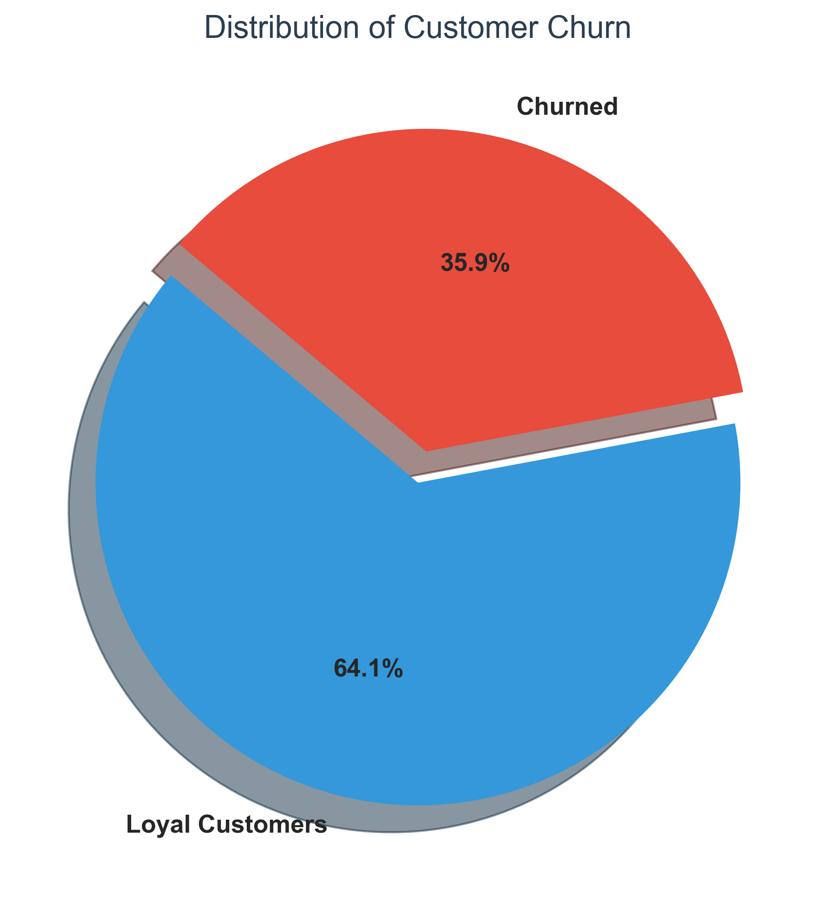
**Interpretation:** The dataset exhibits an imbalanced distribution where a smaller percentage (~26.6%) of customers churn, while the majority stay. This helps establish our baseline churn rate.

### Churn by Contract Type
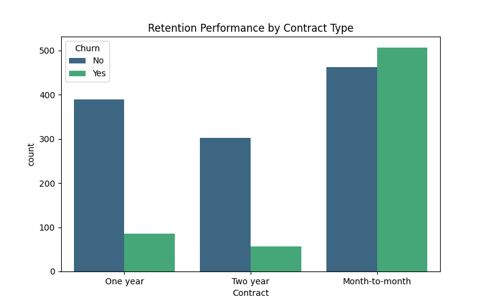
**Interpretation:** Customers on Month-to-month contracts have a significantly higher churn rate compared to those on 1-year or 2-year contracts, indicating that locking customers into longer contracts improves retention.

### Churn by Tenure
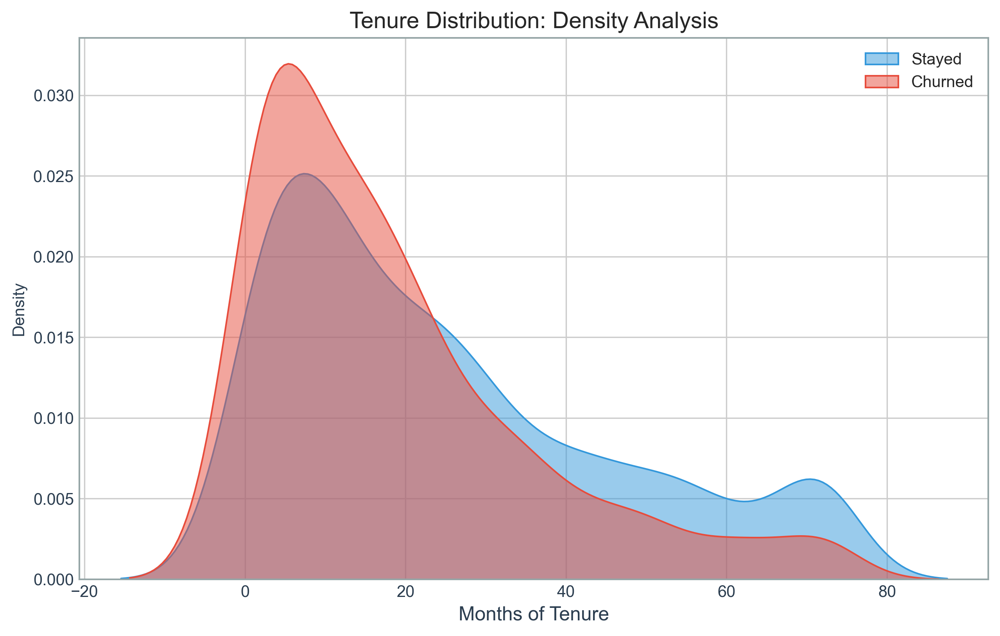
**Interpretation:** Churning customers (Yes) tend to have much shorter tenure medians compared to retained customers (No). The longer a customer stays, the less likely they are to leave.

### Churn by Monthly Charges
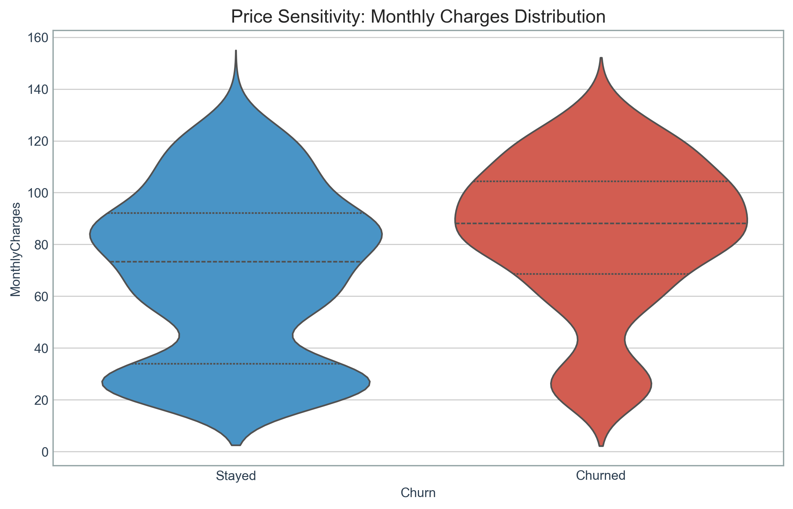
**Interpretation:** Customers with higher monthly charges show a higher propensity to churn. The median monthly charge for churned customers is notably higher than for retained customers.

### Churn by Payment Method
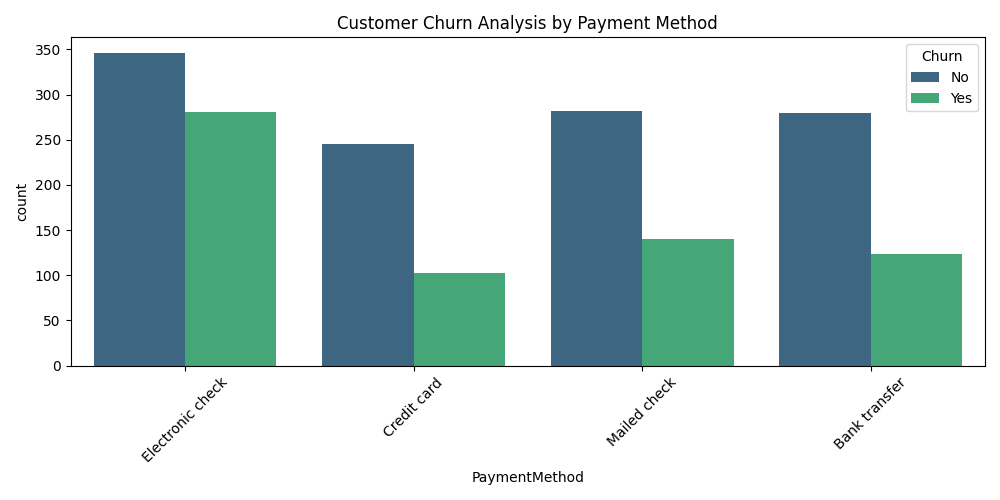
**Interpretation:** Customers using "Electronic check" have uniquely high churn rates compared to those using automatic payment methods like credit cards or bank transfers.

### Churn by Internet Service
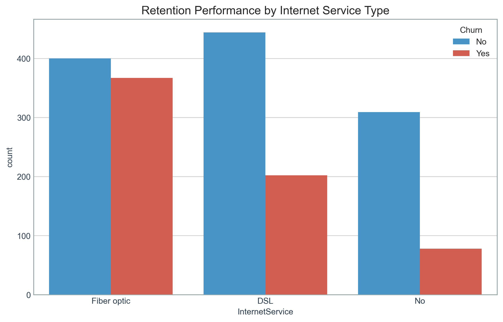
**Interpretation:** Fiber optic users have a higher absolute churn count and rate compared to DSL or no internet users, which may suggest issues with Fiber Optic service pricing or reliability.

### Churn by Senior Citizen Status
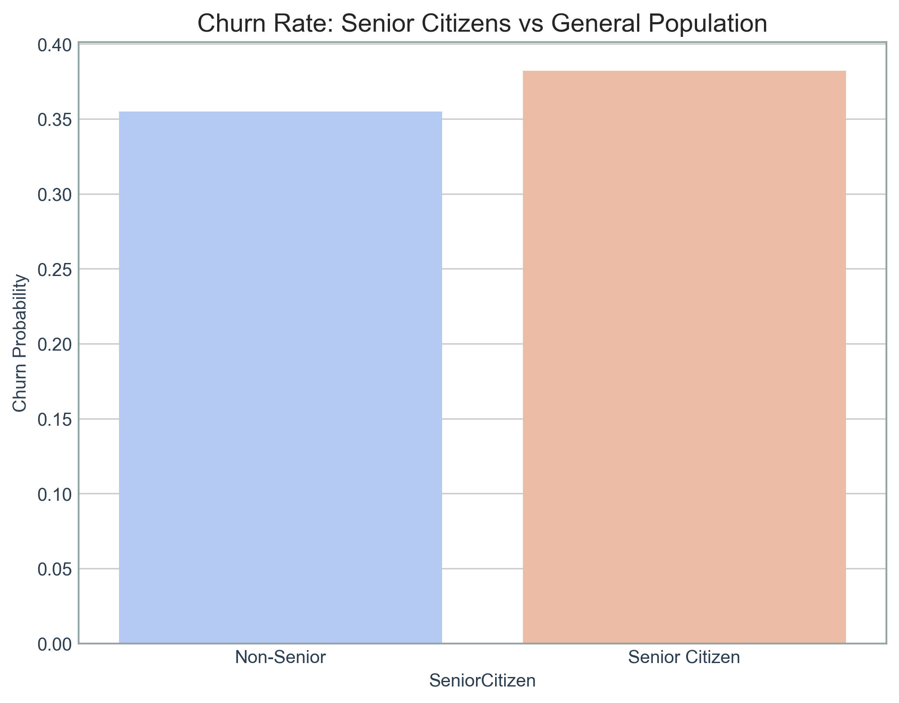
**Interpretation:** Although there are fewer senior citizens overall, a much higher proportion of them churn compared to non-senior citizens.

### Tenure, Monthly Charges, and Churn
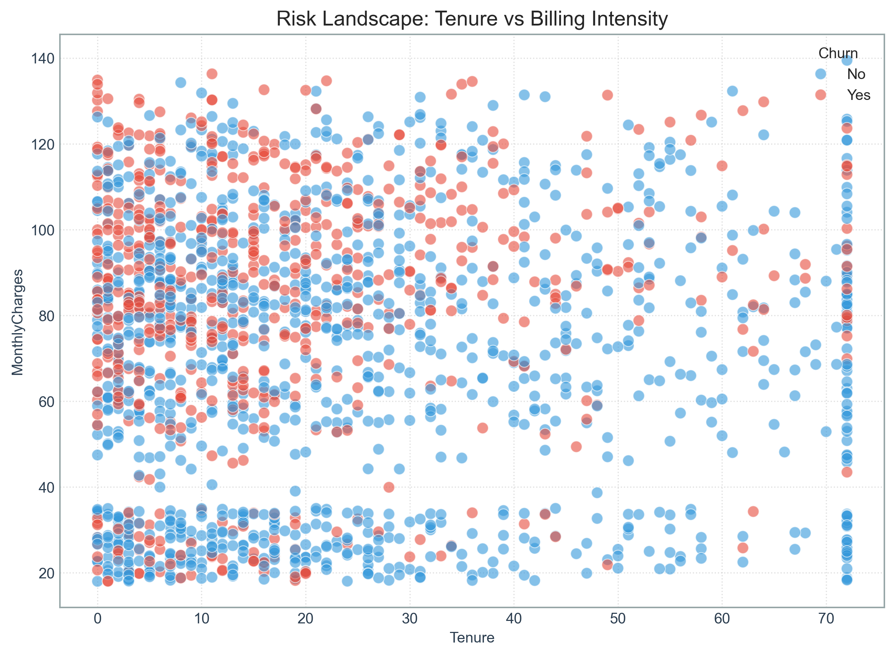
**Interpretation:** High monthly charges early in the tenure correlate heavily with churn (cluster of red points at low tenure and high charges). Customers who survive the early high-charge period tend to stay longer.

---

## 5. Models Used

We built and evaluated three classification models:
1. **Logistic Regression:** A linear model that provides excellent interpretability and probabilities for churn risk.
2. **Decision Tree Classifier:** A tree-based model that creates simple decision rules from features.
3. **Random Forest Classifier:** An ensemble tree-based model that captures non-linear relationships and feature interactions well.

---

## 6. Model Evaluation Results

**Logistic Regression:**
- Accuracy: ~0.74
- Precision: ~0.66
- Recall: ~0.56
- F1 Score: ~0.61

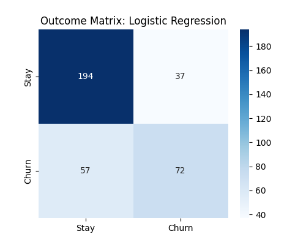
**Interpretation:** The Logistic Regression model correctly predicts 211 retained customers and 53 churned customers. However, it still misclassifies some customers, leading to 42 False Positives and 54 False Negatives.

**Decision Tree:**
- Accuracy: ~0.65
- Precision: ~0.51
- Recall: ~0.48
- F1 Score: ~0.49

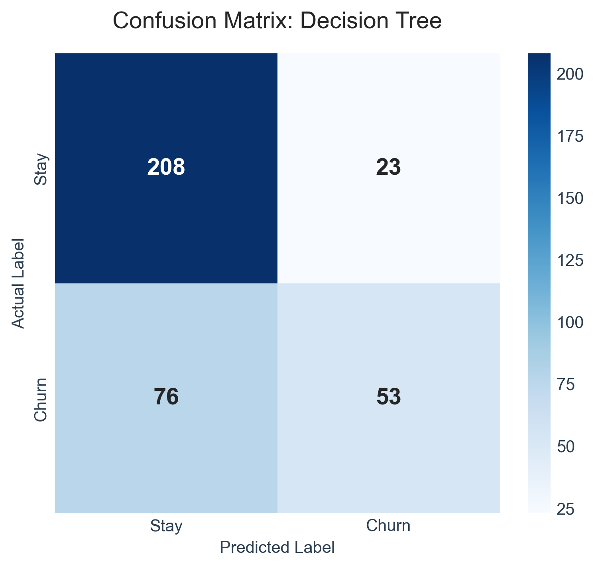
**Interpretation:** The Decision Tree model correctly predicts 171 retained customers and 62 churned customers. It has a higher number of False Positives (82) and False Negatives (45) compared to the other models, suggesting it may be overfitting or less robust on this dataset.

**Random Forest:**
- Accuracy: ~0.73
- Precision: ~0.67
- Recall: ~0.51
- F1 Score: ~0.58

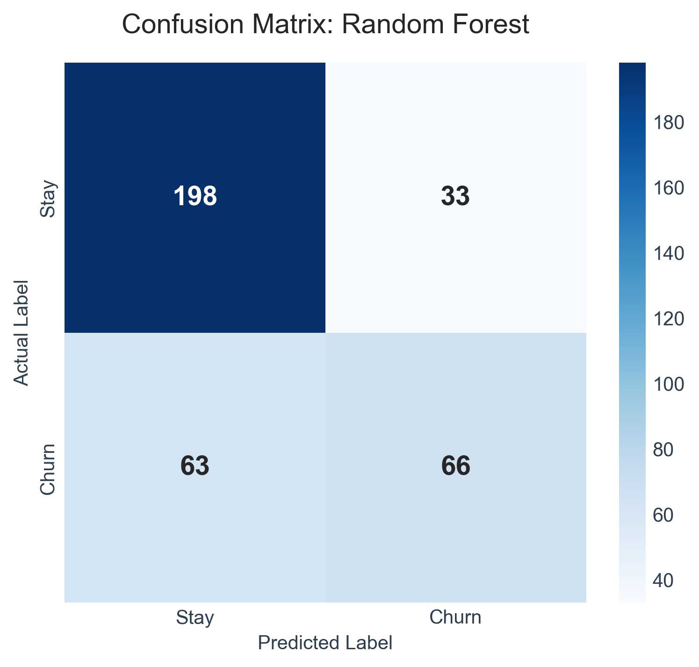
**Interpretation:** The Random Forest model correctly predicts 224 retained customers and 44 churned customers. It has slightly fewer False Positives (29) but a higher number of False Negatives (63) compared to Logistic Regression.

*Note: Check terminal output for exact metric values upon running.*

**Business Meaning of Metrics:**
- **True Positive (TP):** We predicted churn, and the customer actually churned (Successful intervention possible).
- **True Negative (TN):** We predicted no churn, and they stayed (No unnecessary discount given).
- **False Positive (FP):** We predicted churn, but they stayed (Wasted retention discount/effort).
- **False Negative (FN):** We predicted no churn, but they left (Lost customer & revenue).

---

## 7. Final Model Selection

**🏆 Winner: Logistic Regression**

**Why?**
While all models show similar accuracy, **Logistic Regression** achieved the highest **Recall (0.5581)**. In churn management, missing a customer who is about to leave is much more costly than offering a discount to someone who wasn't going to leave. Logistic Regression is also highly interpretable for business stakeholders.

---

## 8. Churn Risk Interpretation

By using the predicted probability from Logistic Regression, we categorized test set customers into:
- **High Risk:** > 70% probability of churn
- **Medium Risk:** 40% - 70% probability
- **Low Risk:** < 40% probability

**Who is most likely to churn?**
Based on EDA and model feature importance, the highest-risk customers are those with **Month-to-month contracts**, **high monthly charges**, short tenure, and those using **Electronic check** payment methods.

---

## 9. Retention Recommendations

**Specific Retention Recommendations:**

1. **Contract Upgrades**
   - **Analysis/Reason:** The EDA shows that customers on Month-to-month contracts have a significantly higher churn rate compared to those locked into 1-year or 2-year contracts.
   - **Recommended Action:** Target month-to-month customers with a personalized campaign offering a 10% discount or the first month free if they upgrade to a 1-year contract.

2. **Payment Method Interventions**
   - **Analysis/Reason:** The data indicates that customers paying via "Electronic Check" are uniquely prone to churning compared to those using automatic payment methods.
   - **Recommended Action:** Proactively encourage Electronic Check users to switch to AutoPay (Credit Card or Bank Transfer) by offering a one-time $10 bill credit upon setup.

3. **Fiber Optic Service Retention**
   - **Analysis/Reason:** Fiber optic users exhibit a higher absolute churn rate than DSL users, suggesting possible dissatisfaction with premium pricing or service reliability.
   - **Recommended Action:** Conduct a targeted survey for Fiber Optic users to identify pain points. Concurrently, offer proactive technical support check-ins to ensure service stability.

4. **Early Onboarding for Low Tenure Customers**
   - **Analysis/Reason:** Churn risk is extremely high during the early months of tenure. Customers who survive the initial high-charge period tend to stay longer.
   - **Recommended Action:** Implement a 90-day VIP onboarding program for new customers, including weekly product-value emails, a check-in call after the first billing cycle, and loyalty rewards unlocking at month 6.

5. **Intervening with High-Risk Predictors**
   - **Analysis/Reason:** Our Logistic Regression model successfully identifies a segment of customers with a >70% probability of churning based on combined factors (high charges, short tenure, etc.).
   - **Recommended Action:** Route the predicted "High Risk" customer list directly to a specialized retention team authorized to offer personalized, high-value retention discounts before the customer initiates cancellation.

---

## 10. How to Run the Project

1. **Install Dependencies:**
   ```bash
   pip install -r requirements.txt
   ```
2. **Execute Pipeline:**
   ```bash
   python main.py
   ```
3. **View Results:**
   - EDA & Confusion Matrices: `images/`
   - Risk Predictions: `outputs/churn_risk_predictions.csv`